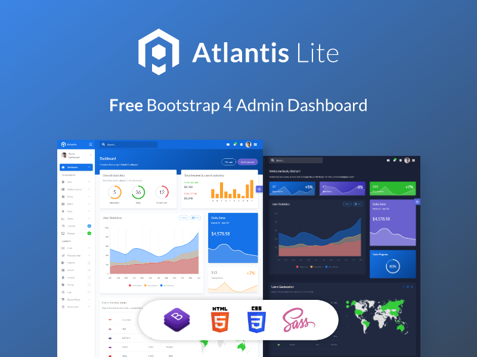

# Atlantis-Lite

> Archived and copied from the [Atlantis Lite - Bootstrap 4 Admin Dashboard](https://themehunt.com/item/1527584-atlantis-lite-bootstrap-4-admin-dashboard) on themehunt.com.  
> This codebase is meant to be used for CSS and web design reference and study purposes only.

### Content

- [Content](#content)
- [Dependencies](#dependencies)
- [Installation](#installation)
- [Usage](#usage)
- [References](#references)

> Free Bootstrap 4 Admin Dashboard
> 
> Atlantis Lite is a free bootstrap 4 admin dashboard that is beautifully and elegantly designed to display various metrics, numbers or data visualization.
> 
> Atlantis Lite admin dashboard has 2 layouts, many plugins and UI components to help developers create dashboards quickly and effectively so they can save development time and also help users to make the right and fast decisions based on existing data.
> 
> We made documentation how you started using this dashboard template and use available components and plugins.

### Dependencies

The following dependecies are used for this project. Feel free to experiment using other dependencies and versions.

1. Windows 64-bit OS
2. NodeJS
	- node version 12.16.3
	- npm version 6.14.4
3. NodeJS modules (installed via npm)
	- gulp v.4.0.2
	- browser-sync v.2.26.7

## Installation

1. Clone this repository.  
`https://github.com/arcsource/template-atlantis.git`

2. Install dependencies.  
`npm install`

## Usage

1. Run the localhost static website development environment.  
`npm run dev`

2.  Edit the existing static files from the **./public** directory and wait for live reload. Your updates will reflect on the web browser.

3. To include new static website files on live reload:
	- Stop the localhost **dev** server.
	- Create your new static (.html, .js, .css) files inside the **./public** directory.
	- Re-start the **dev** server.  
`npm run dev`
    - Launch the demo page on  
`http://localhost:3000/examples/demo1/`

4. Run the production static website (does not use live reload).  
    - Run the local web server.  
`npm run start`
    - Launch the demo page on  
`http://localhost:3003/examples/demo1/`

## References

[[1]](https://github.com/ciatph/webtools) - live reload using gulp v.3.9.1 (older gulp version)  
[[2]](https://trello.com/c/gFN68i6k) - gulp notes (trello)

@weaponsforge  
20211101